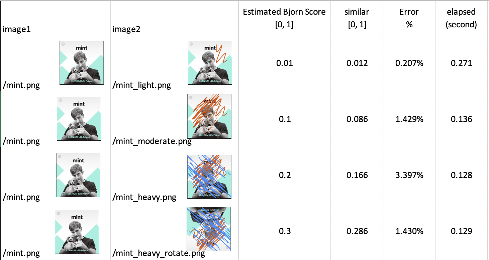
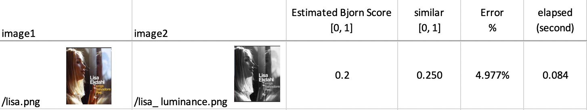
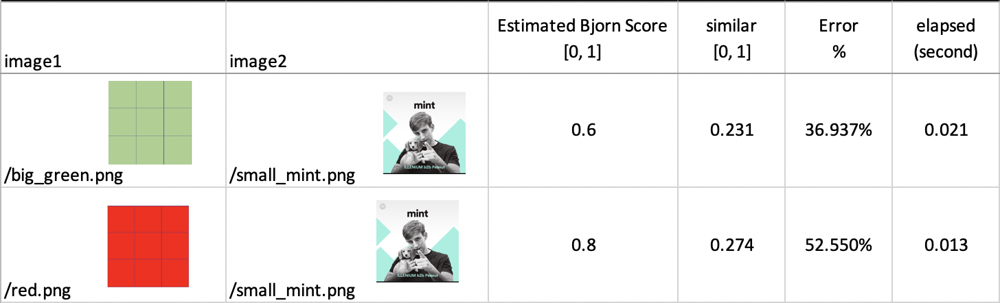
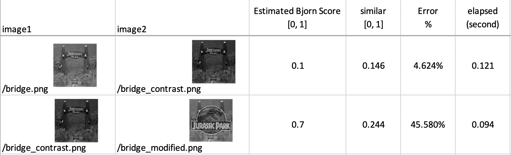

# Image Comparison - Alternative Approach with OpenCV  


> this is another alternative approach to solve the image comparison task, which might not contains as much as detailed documentation as the [pixel comparison approach](https://github.com/discoliver/image_comparison).  


## Table of contents .

* [About the Program](#About-the-Program)
* [Getting Started](#Getting-Started)
* [How to Use the Program](##ow-to-Use-the-Program)
* [Solution Approach](#Solution-Approach)
* [Maintain the Program](#Maintain-the-Program)
* [Contribute and Update](#Contribute-and-Update)
* [Acknowledgments and License](#Acknowledgments-and-License)

## About the Program
A program in Python that compares two images using Structural Similarity Index (SSIM). The input and output of the program will be in a format of cvs file.  

## Getting Started - Steps by Steps
### Environments
The program could be run in both Windows and MacOS system, either in Python IDE or Terminal (Commend Prompt in Windows)

If you are a Mac user, you can either download [PyCharm](https://www.jetbrains.com/pycharm/download/#section=mac) or running in your terminal directly, followed by the below instructions.  
If you are using Windows, you could do:
- Download [PyCharm](https://www.jetbrains.com/pycharm/download/#section=mac) - develop, test and run this program.  
- Download [Git](https://git-scm.com/download/win), and follow the Mac Instructions.  
- Running in Command Prompt directly, however you need to run the Windows version of the commands as this docs mainly cover the Linux/MacOS instruction.  
- You could also setup your virtual environment, you can find details from [here](https://docs.python-guide.org/dev/virtualenvs/).


### Install python  
To run this program, python 3 is required. If you do not have python installed, or wish to updated existing from python 2, you can do it from [download python](https://www.python.org/downloads/).

### Install Other Libraries  
The program requires [OpenCV](https://pypi.org/project/opencv-python/) package in python. You can install it by running following command:
```shell
pip3 install opencv-python
```  
If your default Python distribution does not come with pre-installed  scikit-image,  we need to install [scikit-image](https://scikit-image.org/docs/dev/install.html) inside of already configured default Python environment. This will allow us to use `compare_ssim`, which computes the mean structural similarity index between two images.
```shell
pip3 install scikit-image
```

This is the same command for Windows, MacOS and Linux Installation.


## How to Use the Program

### Clone This Repo
To clone this repo, you can use various source code management tool such as [Source Tree](https://www.sourcetreeapp.com/) and [Github Desktop](https://desktop.github.com/) or simply run
```shell
git clone https://github.com/discoliver/image_comparsion_opencv.git
```


### Running the Program
To run this program, simply run the ** compare.py ** script, following a cvs file path which contains pairs of images.
```shell
python3 compare.py filenae.csv
```
or
```shell
python3 compare.py absolute/path/to/yout/filenae.csv
```
If you have python 2 co-exist with python 3, you need to run

This repo has also provided an example of this input cvs file **images.csv** , which indicate the format should follow for this program to run.

You can also run them in [PyCharm](https://www.jetbrains.com/pycharm/download/#section=mac) as well.


### Result and Test
After successfully run the program (See FAQ for error you might get), you should expect a **result.csv** file in your repo, which contains the information of 2 images, a similarity score converted from Structural Similarity Index (SSIM), and an elapsed time.

Re-run the program will automatically delete the file and regenerate the new result file.  

However well this program perform? The **images.csv** contains a simple test set of images to demonstrate how this program handle each scenario.  

Compared to the test set result from [individual pixel comparison](https://github.com/discoliver/image_comparison#result-and-test), I have included another test analysis based on new test set images. Compared with the actual similarity score and estimated Bjorn Score, the SSIM approach preform better as it can estimate the similarity score based on the structural difference.

---
#### Test with pure color, with accurate result
  

#### Test with pure color and character, with poor prediction as only focus on color scheme.  


#### Test with pure color picture rotation.
  

#### Test with contrast adjustment and photoshoped picture
  


## Solution Approach
### Background
As time permits, I have implemented this  alternative approach to solve the image comparison task, leveraging OpenCV and SSIM method, which might not contains as much as detailed documentation as the pixel [comparison approach](https://github.com/discoliver/image_comparison).  


### Thoughts Gathering
Using the Structural Similarity Index (SSIM), we evaluate the group pof pixel so we can easily determine differences due to slight image manipulations, tampering, adjustment. This approach is better than comparing individual pixel which could be affected by noise and image manipulations. SSIM could help us perceive the change in structural information of the image, such as adjusting the contrast or photoshoped overlay.

With packages `cv2` for OpenCV bindings and `scikit-imag` for pre-definited Structural Similarity Index, this approach is easy to implement and maintain as well.

### Initial Approach
The original workflow of this approach demonstrate as below:

1. Import the Image files into `image_list` from cvs.  
2. For every row of data in cvs (every element in `image_list`), create image `i1` and `i2` using `cv2.imread`.    
```python
imageA = cv2.imread(image_row[0])
imageB = cv2.imread(image_row[1])
```
3. We convert them to grayscale (focus luminance and reduce the complexity of code) and calculate ssim score  
```python
gray_imageA = cv2.cvtColor(imageA, cv2.COLOR_BGR2GRAY)
ssim_score = compare_ssim(gray_imageA, gray_imageB)
```

4. We record the time `elapsed_time` after complete calculation, and convert SSIM range [-1,1] to [0,1].  
```python
score = ssim_score * 0.5 + 0.5
```

5. Import the data, `similarity` and `elapsed_time`into new cvs output file, `result.cvs`.  

### Improvement to be done
There are some work left to improve this work includinbg:
1. Add resize function to enable this program to compare different size of image.
2. We can also compute SSIM for Red, Green, and Blue components and average them together, without greyscaling, which lower the proformance but provide better accuracy.

## Maintain the Program
To Maintain this application, please go through this README carefully and contact me if you have any question. Additional knowledge transfer session will be hold.

Ensure you have understood the logic of the program is fundamental to maintain this project, however, there are couple tips can help as well.  

1. Read error log - details catch error and debug output is written in the script.
2. Check your environment - although this program does not require many dependencies, you still have to check you have correct version of python, and other libraries installed.  
3. Always test it when you contribute this program; Work in specific topic branches and keep the commit history clean, with proper tag if necessary.  
4. Refer to FAQ session for common question.

## Contribute and Update
Your contribution  are warmly welcome to make this project better. Please fork the repository and create pull request if you want. Appreciate anyone to jump in and help out.  

This project does not include much dependency but a few things below could help you maintain the latest version of the application.
- Github Notification when updates or new pull request has been merged (coming)
- Ensure you have the latest version of pillow
- Ensure your Python is up-to-date


## Acknowledgments and License
There are a few helpful examples and research help to shape this project, and they have demonstrated the different perspectives and methods to accomplish the test. Here are some of good references.  

[Zenva](https://www.youtube.com/watch?v=-i3NQ-by2b8),Implementing Structural Similarity for Images。    
[scikit-image](https://scikit-image.org/docs/dev/api/skimage.measure.html),image processing in python.  
[Adrian Rosebrock](https://www.pyimagesearch.com/2017/06/19/image-difference-with-opencv-and-python/),Image Difference with OpenCV and Python.  

This project is licensed under the MIT License.

## FAQ
Frequently asked questions about this program can be found below.  

### How to ensure this program works?
There are some test files in the image folders, which covers different case from modification, contrast adjustment and image rotation. Feel free to contribute more test case or contact the author if you needed.  

### What if I have received error?  
Check the console output to quickly categorize the error either in:  
- Your system environment, either python or related libraries is setup incorrectly.  
- Your input csv contains wrong format.  
- Your image mode is not RGB or the format we do not support.  

### Can I input cvs files with different format?  
Unfortunately, you have to follow the format of the provided csv example.

### Does this program restrict to MacOS?  
This program can be running on MacOS, Windows and Linux, as long as you have configured correctly. (See getting started)
The easiest way to run on Windows is to get Git Bash and follow the MacOS instruction, but you can always run in Windows Command Prompt or Pycharm IDE.  
